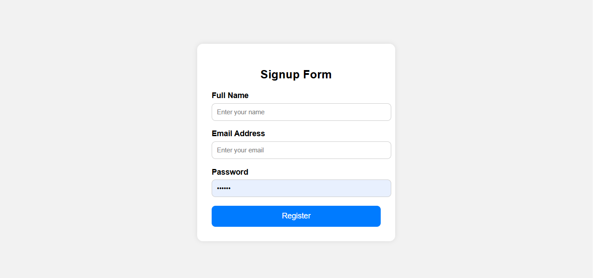

# 🚀 Form Validation Project

A simple and clean **Sign-Up Form** built using **HTML**, **CSS**, and **JavaScript**, with real-time **client-side validation** using regular expressions (regex).

## ✨ Features

- ✅ Full Name field validation (min 3 characters, alphabets & spaces only)
- ✅ Email validation (must be in valid format)
- ✅ Strong Password validation:
  - Minimum 6 characters
  - At least one uppercase letter
  - At least one lowercase letter
  - At least one digit
  - At least one special character (@, #, $, %, !)
- ✅ Inline error messages
- ✅ Form doesn't reload on submit
- ✅ Form reset after successful submission

## 📂 Tech Stack

- **HTML5**
- **CSS3**
-  JavaScript (ES6)

## 📸 Screenshot

-->

